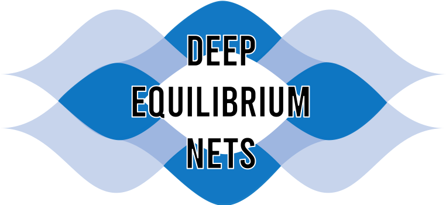

# Replication of Deep Equilibrium Nets

This is a replication attempt of the Deep Equilibrium Nets paper by

* [Marlon Azinovic](https://sites.google.com/view/marlonazinovic/home) (University of Zurich, Department of Banking and Finance and Swiss Finance Institute)
* [Luca Gaegauf](https://www.bf.uzh.ch/en/persons/gaegauf-luca/team) (University of Zurich, Department of Banking and Finance)
* [Simon Scheidegger](https://sites.google.com/site/simonscheidegger/) (University of Lausanne, Department of Finance)

### Author

* [Min Fang](https://www.minfang.info)

